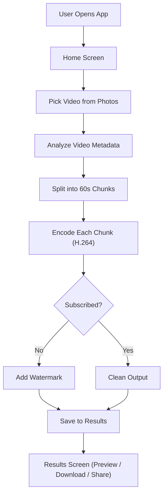
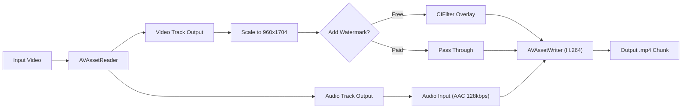

# WAClear - WhatsApp Status Video Optimizer

## Overview

Build "WAClear" -- a production-ready SwiftUI iOS app that converts any iPhone video into WhatsApp status-optimized 1-minute chunks with crystal-clear quality. Free with watermark; Rs 99/month subscription removes it.

---

## Todos

| # | ID | Task | Status |
|---|-----|------|--------|
| 1 | project-setup | Create Xcode project with SwiftUI, configure bundle ID, asset catalog, Info.plist with photo library usage descriptions | pending |
| 2 | models | Create data models: VideoProject, ConversionSettings (encoding params), ChunkResult | pending |
| 3 | video-analyzer | Build VideoAnalyzer service to read input video metadata (duration, resolution, orientation, codec) | pending |
| 4 | video-processor | Build core VideoProcessor using AVAssetReader + AVAssetWriter with H.264 High Profile, 960x1704, 1.8 Mbps VBR, AAC 128kbps | pending |
| 5 | chunk-splitting | Implement 60-second chunk splitting using CMTimeRange on the reader, with progress tracking per chunk | pending |
| 6 | watermark | Build WatermarkRenderer using CoreImage (CISourceOverCompositing) to overlay semi-transparent branding on each frame for free users | pending |
| 7 | home-view | Build HomeView with hero text, gradient Select Video button, recent conversions grid, PHPicker integration | pending |
| 8 | processing-view | Build ProcessingView with animated circular progress ring, chunk counter, time estimate | pending |
| 9 | results-view | Build ResultsView with chunk cards, thumbnails, Save All to Photos, Share to WhatsApp, watermark upsell badge | pending |
| 10 | storekit | Implement StoreManager with StoreKit 2: product fetch, purchase flow, entitlement checking, transaction listener, restore purchases | pending |
| 11 | subscription-view | Build SubscriptionView paywall with pricing, feature list, purchase button, restore link | pending |
| 12 | settings-view | Build SettingsView with restore purchases, app version, support link | pending |
| 13 | polish | Add spring animations, haptic feedback, error handling, edge cases (no audio track, very short video, landscape handling) | pending |
| 14 | app-icon | Design and add app icon, accent colors, launch screen | pending |

---

## Architecture Overview

Native iOS app built with **SwiftUI** (iOS 16+), using **AVFoundation** (AVAssetReader + AVAssetWriter) for on-device video processing and **StoreKit 2** for subscriptions. No backend needed.

### App Flow



---

## WhatsApp Status Optimal Encoding Settings

These are the target output parameters, chosen to maximize clarity while staying within WhatsApp's 16 MB / 60-second status limits:

- **Container**: MP4
- **Video Codec**: H.264 High Profile (Level 3.1) -- universally supported across all WhatsApp clients
- **Resolution**: 960x1704 (9:16 portrait) -- slightly under 1080p to give WhatsApp's re-encoder headroom, avoids quality-destroying downscale
- **Video Bitrate**: ~1.8 Mbps VBR (ensures each 60s chunk stays under 16 MB: `60s x 1.8Mbps = ~13.5 MB + audio`)
- **Frame Rate**: 30 fps (WhatsApp caps at 30fps; higher gets dropped)
- **Audio Codec**: AAC, 128 kbps, 44.1 kHz stereo
- **Keyframe Interval**: Every 2 seconds (GOP = 60 frames)
- **Target file size per chunk**: ~14-15 MB (leaves headroom below 16 MB limit)

---

## Project Structure

```
WAClear/
WAClear.xcodeproj
WAClear/
  WAClearApp.swift                  -- App entry point + scene
  Info.plist
  Assets.xcassets/                  -- App icon, colors, images
  Configuration.storekit            -- StoreKit testing config

  Models/
    VideoProject.swift              -- Video metadata (duration, resolution, chunks)
    ConversionSettings.swift        -- Encoding parameters model
    ChunkResult.swift               -- Output chunk info (URL, size, duration)

  Services/
    VideoProcessor.swift            -- Core AVAssetReader/Writer engine
    VideoAnalyzer.swift             -- Analyze input video metadata
    WatermarkRenderer.swift         -- Overlay watermark for free users
    StoreManager.swift              -- StoreKit 2 subscription manager

  ViewModels/
    HomeViewModel.swift             -- Home screen state management
    ProcessingViewModel.swift       -- Conversion progress tracking
    ResultsViewModel.swift          -- Manage converted chunks
    SubscriptionViewModel.swift     -- Subscription state

  Views/
    HomeView.swift                  -- Landing screen with upload CTA
    VideoPickerView.swift           -- PHPicker wrapper
    ProcessingView.swift            -- Animated progress during conversion
    ResultsView.swift               -- Grid of converted chunks + share/save
    SubscriptionView.swift          -- Paywall screen
    SettingsView.swift              -- App settings

    Components/
      VideoThumbnailCard.swift      -- Thumbnail card component
      GradientButton.swift          -- Reusable styled button
      ChunkCard.swift               -- Individual chunk result card
      AnimatedProgress.swift        -- Circular/ring progress indicator
      WatermarkBadge.swift          -- "Remove watermark" upsell badge

  Utilities/
    Constants.swift                 -- App-wide constants
    Extensions.swift                -- URL, CMTime, FileManager helpers
```

---

## Core Video Processing Engine

The heart of the app. Uses **AVAssetReader** to decode input frames and **AVAssetWriter** to re-encode with precise control over bitrate, resolution, and codec.

### Pipeline for each chunk



### Key implementation details

1. **AVAssetReader** reads the source video with `CMTimeRange` set to each 60-second window
2. **Video output settings**: `kCVPixelFormatType_32BGRA` for processing watermark overlay via CoreImage
3. **AVAssetWriter video settings**:
   - `AVVideoCodecKey: .h264`
   - `AVVideoWidthKey: 960`, `AVVideoHeightKey: 1704`
   - `AVVideoCompressionPropertiesKey`: bitrate 1_800_000, profile H264 High Auto Level, max keyframe interval 60
4. **AVAssetWriter audio settings**: AAC, 128000 bps, 44100 Hz, 2 channels
5. **Watermark**: Rendered via `CIFilter` compositing on each video frame buffer for free users
6. **Progress**: Tracked by comparing processed sample timestamps against chunk duration, published to UI via `@Published` property
7. **Orientation handling**: Read `preferredTransform` from source track, apply inverse transform so output is always correct orientation

### Smart resolution handling

- If input is portrait (9:16 or similar): scale to fit 960x1704
- If input is landscape (16:9): center-crop to 9:16 with slight zoom, or letterbox with blurred background (user choice could be added later; default to crop-to-fill for status)
- Preserve aspect ratio within the target frame

---

## Watermark Strategy (Free vs Paid)

- **Free users**: Semi-transparent "WAClear" text watermark in bottom-right corner, rendered via CoreImage `CITextImageGenerator` + `CISourceOverCompositing` on each frame
- **Subscribed users**: No watermark applied; frames pass through directly
- Watermark is subtle enough to not ruin the video but visible enough to incentivize subscription

---

## Subscription (StoreKit 2)

- **Product ID**: `com.waclear.premium.monthly`
- **Price**: Rs 99/month (auto-renewable)
- **Entitlement check**: `Transaction.currentEntitlements` checked on app launch and cached
- **Paywall trigger**: Shown as a bottom sheet upsell on the results screen (non-blocking), and as a banner on the home screen
- **Restore purchases**: Button in settings
- **Testing**: Local `.storekit` configuration file for sandbox testing

---

## UI Design Direction

- **Theme**: Dark background (#0A0A0F) with vibrant purple-to-blue gradient accents
- **Typography**: SF Pro Display (bold headings), SF Pro Text (body)
- **Cards**: Frosted glass effect (`.ultraThinMaterial`) with rounded corners
- **Animations**: Spring animations on transitions, circular progress ring during processing, confetti/checkmark on completion
- **Haptics**: On video selection, conversion complete, and subscription purchase
- **Layout**: Tab-less single-flow navigation (Home -> Pick -> Process -> Results)

### Home Screen

- Large hero text: "Crystal Clear WhatsApp Status"
- Prominent "Select Video" button with gradient
- Recent conversions grid below (if any)
- Subscription banner at bottom for free users

### Processing Screen

- Animated circular progress ring (per-chunk and overall)
- Current chunk indicator: "Processing chunk 2 of 5"
- Estimated time remaining
- Video thumbnail in center of ring

### Results Screen

- Horizontal scrollable chunk cards with thumbnails
- Each card shows: duration, file size, "Part 1 of N"
- "Save All to Photos" button
- "Share to WhatsApp" button (opens share sheet)
- If free user: "Remove Watermark" upsell badge on each chunk

---

## Key Technical Decisions

- **Video engine** -- AVAssetReader/Writer: Full bitrate/codec control vs limited AVAssetExportSession presets
- **Resolution** -- 960x1704: Sweet spot -- WhatsApp won't downscale aggressively, looks crisp on all phones
- **Codec** -- H.264 High Profile: Universal WhatsApp support across all devices/platforms
- **Bitrate** -- 1.8 Mbps VBR: Fits 60s in ~14 MB (under 16 MB limit) with excellent quality
- **Chunk size** -- 60 seconds: Matches WhatsApp status max duration exactly
- **Watermark** -- CoreImage per-frame: GPU-accelerated, no external dependencies
- **Subscriptions** -- StoreKit 2 native: Modern async/await API, no third-party SDK needed
- **Min iOS** -- 16.0: Covers 95%+ of active iPhones, gives access to modern SwiftUI features

---

## Build Order

Implementation proceeds in this order, each phase building on the previous:

1. **Xcode project setup** -- Create project, configure bundle ID, assets, Info.plist
2. **Data models** -- VideoProject, ConversionSettings, ChunkResult
3. **Video analyzer** -- Read input video metadata (duration, resolution, orientation, codec)
4. **Video processing engine** -- `VideoProcessor` encoding pipeline with AVAssetReader/Writer
5. **Video splitting** -- Time-range based 60-second chunking logic
6. **Watermark renderer** -- CoreImage-based watermark overlay for free users
7. **UI: Home screen** -- PHPicker integration, recent conversions
8. **UI: Processing screen** -- Progress tracking with animations
9. **UI: Results screen** -- Chunk preview, save/share functionality
10. **Subscription system** -- StoreKit 2 paywall, entitlement checks
11. **UI: Subscription paywall** -- Beautiful paywall design
12. **Settings screen** -- Restore purchases, app info
13. **Polish** -- Animations, haptics, error handling, edge cases
14. **App icon and assets** -- Design app icon, launch screen
